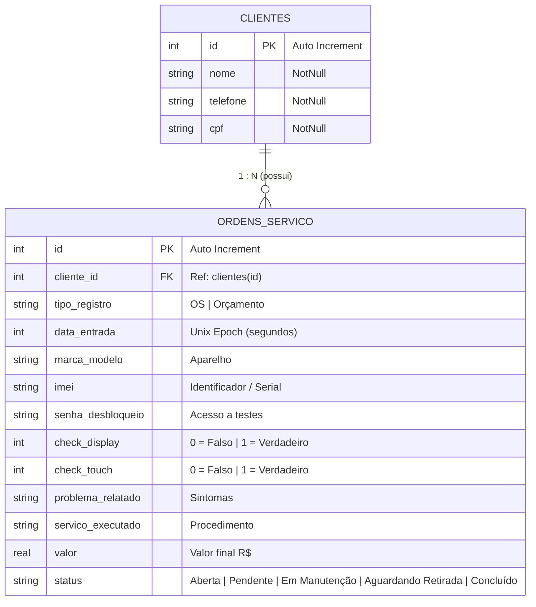

# 📱 Telecell Mobile — Gestor de Ordens de Serviço & Inteligência de Estoque


O **Telecell Mobile** é um aplicativo mobile de alta performance desenvolvido em **Flutter** para gestão completa de assistência técnica de smartphones, tablets e eletrônicos. O sistema une a operacionalização diária de ordens de serviço (OS) e orçamentos (OC), um módulo de **Inteligência de Estoque (Matriz Curva ABC)** e um **Agente Analista de Dados 100% Local (Text-to-SQL)** para tomada de decisão ágil e segura sem necessidade de internet.

---

## 🎯 Principais Funcionalidades

### 1. 📊 Dashboard Estratégico (Visão Geral)
* **Métricas em Tempo Real:** Indicadores visuais do volume total de serviços, divididos por status (*Pendentes*, *Em Manutenção*, *Aguardando Retirada* e *Concluídos*).
* **Busca Inteligente Unificada:** Campo de busca em tempo real com filtro instantâneo por **Nome do Cliente**, **CPF**, **Modelo do Aparelho**, **IMEI** ou **ID da OS**.
* **Navegação por Filtros:** Toque em qualquer card de métrica para filtrar a lista diretamente pela etapa selecionada.
* **Ações Rápidas (Quick Actions):** Atalhos diretos para criação de nova OS, novo Orçamento, consulta de clientes, análise de estoque e Agente IA.

### 2. 📝 Gestão de Ordens de Serviço (OS) & Orçamentos (OC)
* **Diferenciação de Registros:** Suporte nativo para emissão de Ordens de Serviço (OS) e Orçamentos Prévios (OC).
* **Checklist Técnico de Entrada:** Verificação inicial de estado físico do aparelho (teste de Display, Touchscreen, registro de Senha de Desbloqueio e IMEI).
* **Fluxo de Status Dinâmico:** Acompanhamento do ciclo de vida do reparo:
  $$\text{Aberta / Pendente} \longrightarrow \text{Em Manutenção} \longrightarrow \text{Aguardando Retirada} \longrightarrow \text{Concluído}$$
* **Cálculo Financeiro:** Registro de serviços executados e controle de valores finais por atendimento.

### 3. 👥 Gestão de Clientes
* **Cadastro Integrado:** Vinculação automática ou cadastro rápido de clientes no momento da abertura da OS.
* **Histórico por Cliente:** Acompanhamento de todos os dispositivos deixados para manutenção por um determinado cliente.

### 4. 🧠 Módulo de Inteligência de Estoque (Análise Curva ABC)
* **Classificação Automática de Peças:** Algoritmo que analisa o histórico de entradas e categoriza os modelos de smartphones em três classes estratégicas:
  * 🟠 **Classe A (Alta Rotatividade):** Modelos mais frequentes. Recomendação de compras em lote (telas, baterias, conectores) com desconto de atacado e estoque de segurança.
  * 🔵 **Classe B (Média Rotatividade):** Demanda moderada. Recomendação de reposição semanal com estoque mínimo controlado (1 a 2 unidades).
  * 🔘 **Classe C (Baixa Rotatividade):** Aparelhos raros/antigos. Recomendação de compras *Just-in-Time* (aquisição sob demanda após aprovação do orçamento).
* **Visualização Gráfica:** Gráfico de barras dinâmico e interativo impulsionado pelo pacote `fl_chart`.

### 5. 🤖 Agente Analista de Dados 100% Local (Text-to-SQL)
* **Consultas em Linguagem Natural:** Converte perguntas em português (ex: *"Qual foi o meu faturamento no mês?"*) em SQL estritamente em modo de leitura.
* **Execução Offline Segura:** Funciona diretamente no dispositivo com modelo SLM local ou fallback Gemini Cloud.
* **Camada de Proteção `SQLGuard`:** Validação em 6 camadas que impede instruções de escrita (`INSERT`, `UPDATE`, `DELETE`, `DROP`).
* **Documentação Técnica:** Para detalhes completos do módulo, consulte [`DOCS_WALKTHROUGH_AGENTE_ANALISTA_LOCAL.md`](DOCS_WALKTHROUGH_AGENTE_ANALISTA_LOCAL.md).

---

## 🛠️ Arquitetura & Tecnologias

O projeto utiliza arquitetura limpa e padrão de projeto reativo *offline-first*, garantindo resposta instantânea e funcionamento sem dependência de conexão externa com a internet.

| Camada / Componente | Tecnologia Utilizada | Descrição |
| :--- | :--- | :--- |
| **Framework UI** | Flutter 3.8+ (Material Design 3) | Componentes visuais estilizados e responsivos. |
| **Linguagem** | Dart | Orientação a objetos e tipagem forte. |
| **Banco de Dados** | Drift (SQLite Native) | ORM persistente para relacional com suporte a joins complexos e queries tipadas. |
| **Agente Inteligente** | Módulo AI Local (`flutter_gemma`) | Conversão Text-to-SQL com trava de leitura e relatórios Markdown. |
| **Persistência Física** | `sqlite3_flutter_libs` + `path_provider` | Armazenamento local seguro no dispositivo. |
| **Gráficos & BI** | `fl_chart` | Gráficos de barras interativos para análise da curva ABC. |
| **Gerenciamento de Estado** | StatefulWidgets + Reactive Queries | Atualização de UI sincronizada com as operações do banco. |

---

## 📂 Estrutura de Diretórios

```
Telecell-Mobile/
├── DOCS_WALKTHROUGH_AGENTE_ANALISTA_LOCAL.md # Guia técnico do Agente Analista de Dados
├── android/                 # Projeto nativo Android
├── ios/                     # Projeto nativo iOS
├── lib/                     # Código-fonte principal em Dart
│   ├── ai/                  # Módulo do Agente Analista de Dados (Text-to-SQL)
│   │   ├── config/          # Configurações e preferências de IA
│   │   ├── core/            # SQLGuard, CatalogoConsultas e TelecellSchema
│   │   ├── data/            # Executador de queries somente leitura (Drift)
│   │   ├── engines/         # Motores de IA (SLM Local Gemma / Cloud)
│   │   └── analista_controller.dart # Controlador reativo do agente
│   ├── database/            # Camada de Dados e ORM Drift
│   │   ├── README.md        # Documentação dedicada do esquema de banco de dados
│   │   ├── app_database.dart   # Definição das Tabelas (Clientes, OrdensServico) e Queries
│   │   └── app_database.g.dart # Código gerado automaticamente pelo Drift
│   ├── screens/             # Módulos de Interface com o Usuário (UI)
│   │   ├── dashboard_page.dart            # Painel principal e métricas
│   │   ├── cadastro_os_page.dart          # Formulário de criação/edição de OS e OC
│   │   ├── lista_ordens_page.dart         # Listagem unificada de OS e Clientes
│   │   ├── detalhes_os_page.dart          # Visualização detalhada e troca de status
│   │   ├── inteligencia_estoque_page.dart # Gráficos e recomendações Curva ABC
│   │   ├── analista_ia_page.dart          # Interface de Chat com o Agente Analista
│   │   └── configuracoes_ia_page.dart     # Configurações do motor de IA
│   └── main.dart            # Ponto de entrada do aplicativo e configuração de rotas
├── test/                    # Testes automatizados (inclui sql_guard_test.dart)
├── pubspec.yaml             # Especificação de dependências e metadados
└── README.md                # Documentação principal do projeto
```

---

## 🗄️ Arquitetura & Modelo de Dados do Banco (Drift / SQLite)

> 📘 **Documentação Dedicada do Banco:** Para uma análise detalhada da camada de dados, consulte [`lib/database/README.md`](lib/database/README.md).

O banco de dados relacional foi construído com **Drift ORM** sobre a engine **SQLite** nativa. O acesso aos dados segue o padrão **Singleton** (`AppDatabase`) com inicialização assíncrona (`LazyDatabase`) no diretório de documentos do aplicativo.

### 📋 Dicionário de Tabelas no SQLite

O Drift converte a definição das entidades Dart para identificadores SQL em `snake_case`:

#### 1. Tabela `clientes`
| Coluna (SQL) | Tipo (SQLite) | Restrições | Descrição |
| :--- | :--- | :--- | :--- |
| `id` | `INTEGER` | `PRIMARY KEY AUTOINCREMENT` | Identificador único do cliente |
| `nome` | `TEXT` | `NOT NULL` | Nome completo do cliente |
| `telefone` | `TEXT` | `NOT NULL` | Telefone de contato / WhatsApp |
| `cpf` | `TEXT` | `NOT NULL` | CPF do cliente |

#### 2. Tabela `ordens_servico` (`OrdemDeServico`)
| Coluna (SQL) | Tipo (SQLite) | Restrições | Descrição |
| :--- | :--- | :--- | :--- |
| `id` | `INTEGER` | `PRIMARY KEY AUTOINCREMENT` | Número identificador da OS / Orçamento |
| `cliente_id` | `INTEGER` | `FOREIGN KEY -> clientes(id)` | Chave Estrangeira apontando para o cliente |
| `tipo_registro` | `TEXT` | `NOT NULL` | `"OS"` ou `"Orçamento"` (com cedilha) |
| `data_entrada` | `INTEGER` | `NOT NULL` | Data/Hora armazenada em Unix Epoch (segundos) |
| `marca_modelo` | `TEXT` | `NOT NULL` | Marca e modelo do aparelho (ex: *"Samsung Galaxy S21"*) |
| `imei` | `TEXT` | `NOT NULL` | Código IMEI / Serial ou CPF de controle do registro |
| `senha_desbloqueio` | `TEXT` | `NOT NULL` | Senha de acesso para realização de testes |
| `check_display` | `INTEGER` | `DEFAULT 0` | Checklist: Display ok (0 = Não, 1 = Sim) |
| `check_touch` | `INTEGER` | `DEFAULT 0` | Checklist: Touch ok (0 = Não, 1 = Sim) |
| `problema_relatado` | `TEXT` | `NOT NULL` | Defeito relatado pelo cliente |
| `servico_executado` | `TEXT` | `NULLABLE` | Detalhamento do reparo efetuado pelo técnico |
| `valor` | `REAL` | `NULLABLE` | Valor total cobrado pelo serviço (R$) |
| `status` | `TEXT` | `DEFAULT 'Aberta'` | Valores: `'Aberta'`, `'Pendente'`, `'Em Manutenção'`, `'Aguardando Retirada'`, `'Concluído'`, `'Concluída'` |

---

### 📐 Diagrama Entidade-Relacionamento (ERD)



---

### ⚡ Queries & Agregadores Notáveis

- **Junções de Tabelas (Inner Join):** `listarOrdensComCliente()` realiza o `INNER JOIN` entre `ordens_servico` e `clientes`, mapeando o resultado para a classe auxiliar `OrdemComCliente`.
- **Filtros Dinâmicos:** `buscarOrdens()` efetua buscas combinadas utilizando `LIKE '%termo%'` no nome do cliente e verificação exata de status.
- **Agrupamento de BI (Curva ABC):** `obterVolumePorModelo()` executa uma query agregada (`selectOnly`) com `groupBy([marca_modelo])` e contagem `count()`, ordenando os modelos de maior demanda para o cálculo da Curva ABC.
- **Segurança de Leitura (`SQLGuard`):** O módulo de IA executa queries arbitrárias geradas por SLM/Cloud via `customSelect()`, com validação rigorosa de comandos estritamente de leitura.

---

## 🚀 Como Executar o Projeto

### Pré-requisitos
* [Flutter SDK](https://docs.flutter.dev/get-started/install) instalado (versão `>= 3.8.1`)
* Dispositivo físico Android/iOS ou Emulador (Android Studio / Xcode)
* Git instalado

### Passo a Passo

1. **Clonar o Repositório:**
   ```bash
   git clone https://github.com/AnthyGuedes/Telecell-Mobile.git
   cd Telecell-Mobile
   ```

2. **Instalar as Dependências:**
   ```bash
   flutter pub get
   ```

3. **Gerar os arquivos do Drift ORM (Opcional se alterado o esquema):**
   ```bash
   dart run build_runner build --delete-conflicting-outputs
   ```

4. **Executar a Aplicação:**
   ```bash
   flutter run
   ```

---

## 💎 Diferenciais e Boas Práticas Aplicadas

- **Offline-First:** Dados 100% salvos localmente via SQLite com baixíssima latência.
- **IA Privada e Segura:** Agente Analista com validação `SQLGuard` executando em modo leitura.
- **UX Adaptativa:** Formulários de fácil preenchimento com teclado otimizado para ambiente de oficina/balcão.
- **Data-Driven Inventory Management:** Decisão de compra baseada em evidência empírica das ordens de serviço executadas.
- **Design System Coeso:** Paleta de cores moderna com Material 3, cantos arredondados e navegação fluida.

---

<p align="center">
  Desenvolvido por <b>Anthy Guedes</b> 🚀
</p>
