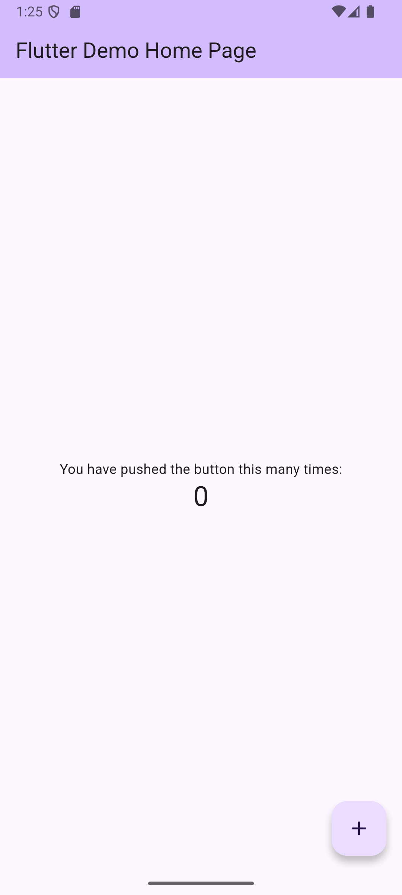
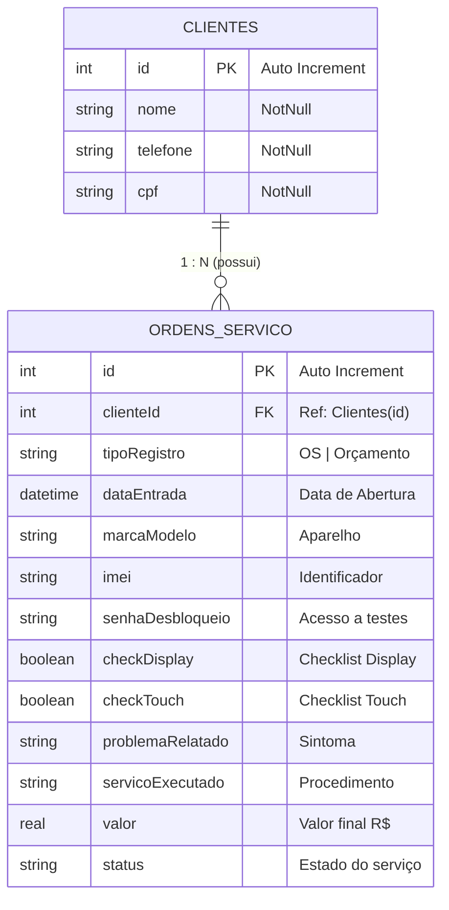

# 📱 Telecell Mobile — Gestor de Ordens de Serviço & Inteligência de Estoque


O **Telecell Mobile** é um aplicativo mobile de alta performance desenvolvido em **Flutter** para gestão completa de assistência técnica de smartphones, tablets e eletrônicos. O sistema une a operacionalização diária de ordens de serviço (OS) e orçamentos (OC) a um módulo inovador de **Inteligência de Estoque (Matriz Curva ABC)**, auxiliando técnicos e gestores a otimizar compras de peças e reduzir capital imobilizado.

---

## 📸 Demonstração Visual & Telas

| Dashboard & Métricas | Inteligência de Estoque (Curva ABC) |
| :---: | :---: |
|  |  |

---

## 🎯 Principais Funcionalidades

### 1. 📊 Dashboard Estratégico (Visão Geral)
* **Métricas em Tempo Real:** Indicadores visuais do volume total de serviços, divididos por status (*Pendentes*, *Em Manutenção*, *Aguardando Retirada* e *Concluídos*).
* **Busca Inteligente Unificada:** Campo de busca em tempo real com filtro instantâneo por **Nome do Cliente**, **CPF**, **Modelo do Aparelho**, **IMEI** ou **ID da OS**.
* **Navegação por Filtros:** Toque em qualquer card de métrica para filtrar a lista diretamente pela etapa selecionada.
* **Ações Rápidas (Quick Actions):** Atalhos diretos para criação de nova OS, novo Orçamento, consulta de clientes e análise de estoque.

### 2. 📝 Gestão de Ordens de Serviço (OS) & Orçamentos (OC)
* **Diferenciação de Registros:** Suporte nativo para emissão de Ordens de Serviço (OS) e Orçamentos Prévios (OC).
* **Checklist Técnico de Entrada:** Verificação inicial de estado físico do aparelho (teste de Display, Touchscreen, registro de Senha de Desbloqueio e IMEI).
* **Fluxo de Status Dinâmico:** Acompanhamento do ciclo de vida do reparo:
  $$\text{Aberta / Pendente} \longrightarrow \text{Em Manutenção} \longrightarrow \text{Aguardando Retirada} \longrightarrow \text{Concluído}$$
* **Cálculo Financeiro:** Registro de serviços executados e controle de valores finais por atendimento.

### 3. 👥 Gestão de Clientes
* **Cadastro Integrado:** Vinculação automática ou cadastro rápido de clientes no momento da abertura da OS.
* **Histórico por Cliente:** Acompanhamento de todos os dispositivos deixados para manutenção por um determinado cliente.

### 4. 🧠 Módulo de Inteligência de Estoque (Análise Curva ABC)
* **Classificação Automática de Peças:** Algoritmo que analisa o histórico de entradas e categoriza os modelos de smartphones em três classes estratégicas:
  * 🟠 **Classe A (Alta Rotatividade):** Modelos mais frequentes. Recomendação de compras em lote (telas, baterias, conectores) com desconto de atacado e estoque de segurança.
  * 🔵 **Classe B (Média Rotatividade):** Demanda moderada. Recomendação de reposição semanal com estoque mínimo controlado (1 a 2 unidades).
  * 🔘 **Classe C (Baixa Rotatividade):** Aparelhos raros/antigos. Recomendação de compras *Just-in-Time* (aquisição sob demanda após aprovação do orçamento).
* **Visualização Gráfica:** Gráfico de barras dinâmico e interativo impulsionado pelo pacote `fl_chart`.

---

## 🛠️ Arquitetura & Tecnologias

O projeto utiliza arquitetura limpa e padrão de projeto reativo *offline-first*, garantindo resposta instantânea e funcionamento sem dependência de conexão externa com a internet.

| Camada / Componente | Tecnologia Utilizada | Descrição |
| :--- | :--- | :--- |
| **Framework UI** | Flutter 3.8+ (Material Design 3) | Componentes visuais estilizados e responsivos. |
| **Linguagem** | Dart | Orientação a objetos e tipagem forte. |
| **Banco de Dados** | Drift (SQLite Native) | ORM persistente para relacional com suporte a joins complexos e queries tipadas. |
| **Persistência Física** | `sqlite3_flutter_libs` + `path_provider` | Armazenamento local seguro no dispositivo. |
| **Gráficos & BI** | `fl_chart` | Gráficos de barras interativos para análise da curva ABC. |
| **Gerenciamento de Estado** | StatefulWidgets + Reactive Queries | Atualização de UI sincronizada com as operações do banco. |

---

## 📂 Estrutura de Diretórios

```
Telecell-Mobile/
├── assets/                  # Imagens e recursos visuais do projeto
├── android/                 # Projeto nativo Android
├── ios/                     # Projeto nativo iOS
├── lib/                     # Código-fonte principal em Dart
│   ├── database/            # Camada de Dados e ORM Drift
│   │   ├── app_database.dart   # Definição das Tabelas, Relacionamentos e Queries SQL
│   │   └── app_database.g.dart # Código gerado automaticamente pelo Drift
│   ├── screens/             # Módulos de Interface com o Usuário (UI)
│   │   ├── dashboard_page.dart            # Painel principal e métricas
│   │   ├── cadastro_os_page.dart          # Formulário de criação/edição de OS e OC
│   │   ├── lista_ordens_page.dart         # Listagem unificada de OS e Clientes
│   │   ├── detalhes_os_page.dart          # Visualização detalhada e troca de status
│   │   └── inteligencia_estoque_page.dart # Gráficos e recomendações Curva ABC
│   └── main.dart            # Ponto de entrada do aplicativo e configuração de rotas
├── pubspec.yaml             # Especificação de dependências e metadados
└── README.md                # Documentação e walkthrough do projeto
```

---

## 🗄️ Arquitetura & Modelo de Dados do Banco (Drift / SQLite)

> 📘 **Documentação Dedicada:** Para uma análise técnica aprofundada dos arquivos da camada de persistência, consulte o documento [`lib/database/README.md`](lib/database/README.md).

O banco de dados relacional foi construído com **Drift ORM** sobre engine **SQLite** nativo. O acesso aos dados segue o padrão **Singleton** (`AppDatabase`) com inicialização assíncrona (`LazyDatabase`) no diretório seguro da aplicação.

### 📋 Dicionário de Tabelas

#### 1. Tabela `Clientes`
| Coluna | Tipo | Restrições | Descrição |
| :--- | :--- | :--- | :--- |
| `id` | `INTEGER` | `PRIMARY KEY AUTOINCREMENT` | Identificador único do cliente |
| `nome` | `TEXT` | `NOT NULL` | Nome completo do cliente |
| `telefone` | `TEXT` | `NOT NULL` | Telefone de contato / WhatsApp |
| `cpf` | `TEXT` | `NOT NULL` | CPF do cliente |

#### 2. Tabela `OrdensServico` (`OrdemDeServico`)
| Coluna | Tipo | Restrições | Descrição |
| :--- | :--- | :--- | :--- |
| `id` | `INTEGER` | `PRIMARY KEY AUTOINCREMENT` | Número identificador da OS / Orçamento |
| `clienteId` | `INTEGER` | `FOREIGN KEY -> Clientes(id)` | Vínculo com o cliente cadastrado |
| `tipoRegistro` | `TEXT` | `NOT NULL` | Classificação: `"OS"` ou `"Orçamento"` |
| `dataEntrada` | `DATETIME` | `NOT NULL` | Data/Hora de abertura |
| `marcaModelo` | `TEXT` | `NOT NULL` | Modelo do aparelho (ex: *"iPhone 13"*) |
| `imei` | `TEXT` | `NOT NULL` | Código IMEI / Serial do dispositivo |
| `senhaDesbloqueio` | `TEXT` | `NOT NULL` | Senha de acesso para realização de testes |
| `checkDisplay` | `BOOLEAN` | `DEFAULT FALSE` | Checklist: Tela e imagem operacionais |
| `checkTouch` | `BOOLEAN` | `DEFAULT FALSE` | Checklist: Touchscreen responsivo |
| `problemaRelatado` | `TEXT` | `NOT NULL` | Descrição do problema fornecida pelo cliente |
| `servicoExecutado` | `TEXT` | `NULLABLE` | Descrição técnica do reparo efetuado |
| `valor` | `REAL` | `NULLABLE` | Valor cobrado pelo serviço (R$) |
| `status` | `TEXT` | `DEFAULT 'Aberta'` | Etapa atual do atendimento |

---

### 📐 Diagrama Entidade-Relacionamento (ERD)



---

### ⚡ Queries & Funcionalidades da Camada de Dados

- **Junções de Tabelas (Inner Join):** Método `listarOrdensComCliente()` realiza a junção de `OrdensServico` com `Clientes` e remapeia os resultados em objetos compostos `OrdemComCliente`.
- **Filtro Dinâmico:** Método `buscarOrdens()` efetua buscas combinadas e case-insensitive via cláusulas `LIKE` e verificações de `status`.
- **Agrupamento de BI (Curva ABC):** Método `obterVolumePorModelo()` executa consulta customizada (`selectOnly`) com `groupBy([marcaModelo])` e agregação `count()`, ordenando os modelos de maior fluxo para alimentar o gráfico de inteligência de estoque.

---


## 🚀 Como Executar o Projeto

### Pré-requisitos
* [Flutter SDK](https://docs.flutter.dev/get-started/install) instalado (versão `>= 3.8.1`)
* Dispositivo físico Android/iOS ou Emulador (Android Studio / Xcode)
* Git instalado

### Passo a Passo

1. **Clonar o Repositório:**
   ```bash
   git clone https://github.com/AnthyGuedes/Telecell-Mobile.git
   cd Telecell-Mobile
   ```

2. **Instalar as Dependências:**
   ```bash
   flutter pub get
   ```

3. **Gerar os arquivos do Drift ORM (Opcional se alterado o esquema):**
   ```bash
   dart run build_runner build --delete-conflicting-outputs
   ```

4. **Executar a Aplicação:**
   ```bash
   flutter run
   ```

---

## 💎 Diferenciais e Boas Práticas Aplicadas

- **Offline-First:** Dados 100% salvos localmente via SQLite com baixíssima latência.
- **UX Adaptativa:** Formulários de fácil preenchimento com teclado otimizado para ambiente de oficina/balcão.
- **Data-Driven Inventory Management:** Decisão de compra baseada em evidência empírica das ordens de serviço executadas.
- **Design System Coeso:** Paleta de cores moderna com Material 3, cantos arredondados, contraste acessível e cartões de navegação intuitivos.

---

<p center="align">
  Desevolvido por <b>Anthy Guedes</b> 🚀
</p>
