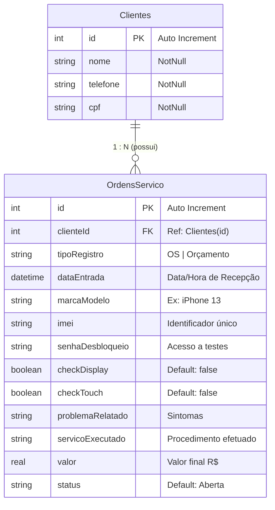

# 🗄️ Documentação do Banco de Dados — Telecell Mobile

Esta documentação detalha a arquitetura, estrutura de tabelas, relacionamentos, queries e padrões de persistência utilizados na camada de dados do **Telecell Mobile**.

---

## 🛠️ Tecnologias e Padrões de Design

- **ORM / Query Builder:** [Drift (anteriormente Moor)](https://drift.simonbinder.eu/) — Versão `^2.14.0`
- **Engine Relacional:** SQLite nativo via `sqlite3_flutter_libs` (`^0.5.15`)
- **Localização de Arquivo:** `getApplicationDocumentsDirectory()` via `path_provider` (`gestor_os.db`)
- **Padrão de Projeto:** Singleton Pattern com Conexão Assíncrona (`LazyDatabase`)

---

## 📐 Estrutura de Tabelas & Dicionário de Dados

### 1. Tabela: `Clientes`

Armazena os dados cadastrais dos clientes da assistência técnica.

| Coluna | Tipo Drift | Tipo Dart | Restrições / Atributos | Descrição |
| :--- | :--- | :--- | :--- | :--- |
| `id` | `IntColumn` | `int` | `autoIncrement()`, `PK` | Identificador único autoincrementável do cliente. |
| `nome` | `TextColumn` | `String` | `NotNull` | Nome completo do cliente. |
| `telefone` | `TextColumn` | `String` | `NotNull` | Telefone de contato / WhatsApp. |
| `cpf` | `TextColumn` | `String` | `NotNull` | Cadastro de Pessoa Física do cliente. |

### 2. Tabela: `OrdensServico` (`@DataClassName('OrdemDeServico')`)

Armazena o registro completo de Ordens de Serviço (OS) e Orçamentos (OC).

| Coluna | Tipo Drift | Tipo Dart | Restrições / Atributos | Descrição |
| :--- | :--- | :--- | :--- | :--- |
| `id` | `IntColumn` | `int` | `autoIncrement()`, `PK` | Identificador único da Ordem de Serviço ou Orçamento. |
| `clienteId` | `IntColumn` | `int` | `references(Clientes, #id)` | Chave Estrangeira apontando para `Clientes.id`. |
| `tipoRegistro` | `TextColumn` | `String` | `NotNull` | Classificação do registro (`"OS"` ou `"Orçamento"`). |
| `dataEntrada` | `DateTimeColumn` | `DateTime` | `NotNull` | Data e hora em que o aparelho foi deixado na loja. |
| `marcaModelo` | `TextColumn` | `String` | `NotNull` | Fabricante e modelo do aparelho (ex: *"Samsung Galaxy S21"*). |
| `imei` | `TextColumn` | `String` | `NotNull` | Código IMEI ou identificador serial do aparelho. |
| `senhaDesbloqueio` | `TextColumn` | `String` | `NotNull` | Senha de padrão/PIN do aparelho para testes do técnico. |
| `checkDisplay` | `BoolColumn` | `bool` | `withDefault(false)` | Checklist: Display/imagem funcionando na entrada? |
| `checkTouch` | `BoolColumn` | `bool` | `withDefault(false)` | Checklist: Touchscreen respondendo perfeitamente? |
| `problemaRelatado` | `TextColumn` | `String` | `NotNull` | Descrição do defeito relatado pelo cliente. |
| `servicoExecutado` | `TextColumn` | `String?` | `Nullable` | Detalhamento técnico do conserto realizado. |
| `valor` | `RealColumn` | `double?` | `Nullable` | Valor total em Reais (R$) cobrado pelo serviço. |
| `status` | `TextColumn` | `String` | `withDefault('Aberta')` | Etapa atual (`"Aberta"`, `"Pendente"`, `"Em Manutenção"`, `"Aguardando Retirada"`, `"Concluído"`). |

---

## 🔗 Diagrama Entidade-Relacionamento (ERD)



---

## 🔍 Queries & Métodos Notáveis (`AppDatabase`)

### 1. Consultas com JOIN (`OrdemComCliente`)
O Drift permite mapear junções de tabelas para objetos compostos auxiliares:

```dart
class OrdemComCliente {
  final OrdemDeServico ordem;
  final Cliente cliente;
  OrdemComCliente({required this.ordem, required this.cliente});
}
```

- **`listarOrdensComCliente()`**: Executa um `INNER JOIN` entre `OrdensServico` e `Clientes`, retornando todas as ordens ordenadas decrescentemente por `dataEntrada`.
- **`buscarOrdens({String? nomeCliente, String? status})`**: Filtra dinamicamente ordens ativas com suporte a busca parcial (`LIKE %nome%`) e correspondência de status.

### 2. Agrupamento BI — Inteligência de Estoque (`ModeloVolume`)
Query utilizada para calcular o volume de atendimento por modelo e alimentar a **Curva ABC**:

```dart
Future<List<ModeloVolume>> obterVolumePorModelo() async {
  final countExpr = ordensServico.id.count();
  final query = selectOnly(ordensServico)
    ..addColumns([ordensServico.marcaModelo, countExpr])
    ..groupBy([ordensServico.marcaModelo])
    ..orderBy([OrderingTerm.desc(countExpr)]);
  ...
}
```

---

## ⚡ Ciclo de Vida da Conexão e Geração de Código

1. **Definição de Esquema:** Os arquivos `Clientes` e `OrdensServico` estendem `Table` em `lib/database/app_database.dart`.
2. **Geração Automática (`build_runner`):** O comando `dart run build_runner build` compila o arquivo de extensão `app_database.g.dart`, contendo as classes data (`Cliente`, `OrdemDeServico`) e companions (`ClientesCompanion`, `OrdensServicoCompanion`).
3. **Persistência Assíncrona:** A função `_abrirConexao()` abre ou cria a base SQLite `gestor_os.db` de forma diferida (*lazy*).

---

## 🔄 Versionamento & Migrações

- **Versão Atual de Schema:** `1`
- Para futuras alterações de estrutura (ex: adição de novas colunas), deve-se incrementar a propriedade `schemaVersion` e implementar o método `migration` no `AppDatabase`.
